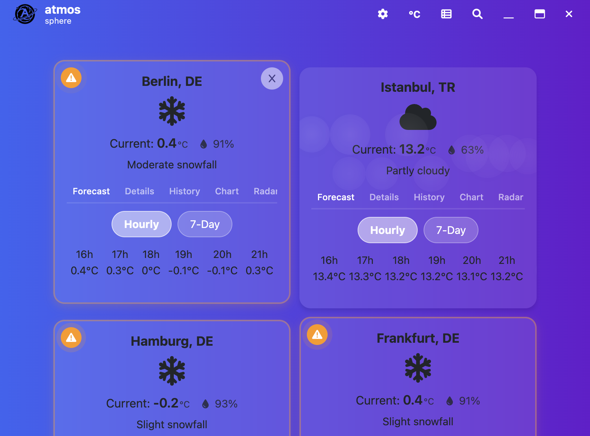

# atmos sphere - A Weather App

A cross-platform Electron app to display weather for cities worldwide. Each city can be easily added and removed through the search bar. The searchbar can be hided to have full screen weather city status.




## Features
- **Search for Cities**: Autocomplete suggestions for cities.
- **Weather Details**: Current weather and 6-hour forecast.
- **Custom UI**: Headless window with a custom title bar.


## Technologies
- **Electron**: For building cross-platform desktop apps.
- **Bootstrap**: For responsive and modern UI.
- **Open-Meteo API**: For weather and geocoding data.
- **Jest**: For unit and integration testing.
# Local Deployment
The installable files of atmos sphere application is generated through the GitHub pipeline for the different type of OSes. 
In case you aim at changing the code, you can simply clone, change and run the code as instructured below.
## Setup
1. Clone the repository:
   ```bash
   git clone https://github.com/your-username/atmos-app.git
2. Start the project

    ```
    npm start
    ```

## Build

1. Build the project 
```
   npm run build
```
